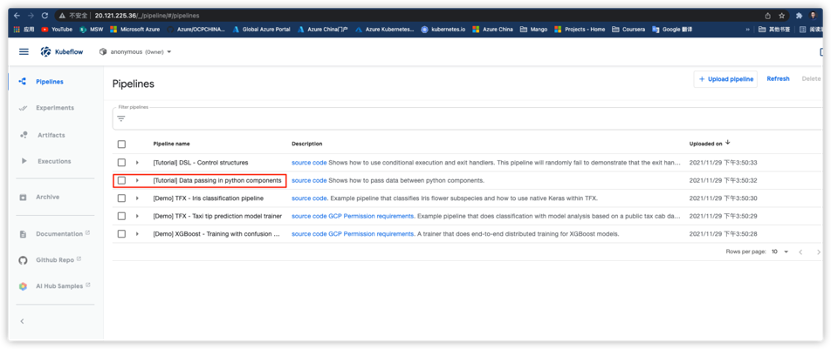

## 在AKS上构建Kubeflow Machine Learning 平台
###  **标准安装步骤**

Kubeflow 社区官方提供了如何使用 kfctl 二进制文件在 Azure 上部署
Kubeflow的指南。然而由于Azure Kubernetes Service对K8S版本的升级，
使用该指南安装后，并不能成功运行Kuberflow,我们可以先按如下标准步骤进行安装，在下一个章节（修改配置）进行Bug修补和配置修改，确保可以成功部署Kuberflow。

#### 先决条件

-   Kubeflow 部署在AKS上，允许数据科学家对 CPU 和 GPU
    进行可扩展的访问，这些 CPU 和 GPU
    在计算需要大量活动时自动增加，并在完成后缩减。**如在AKS上需要使用GPU节点，请先配置GPU
    node pool，按照Azure官方指南即可**
    。如使用普通CPU计算节点，可以忽略此步骤。

-   安装[kubectl](https://kubernetes.io/docs/tasks/tools/install-kubectl/#install-kubectl-on-linux)

-   安装和配置[Azure 命令行界面
    (Az)](https://docs.microsoft.com/en-us/cli/azure/install-azure-cli?view=azure-cli-latest)

    -   登录 az login

-   安装 Docker

    -   对于 Windows 和
        WSL：[指南](https://docs.docker.com/docker-for-windows/wsl/)

    -   对于其他操作系统：[Docker
        桌面](https://docs.docker.com/docker-hub/)

你不需要拥有适用于 AKS（Azure Kubernetes 服务）的现有 Azure
资源组或群集。您可以在部署过程中创建集群。

#### 了解部署过程

部署过程由以下命令控制：

-   **build** -（可选）创建配置文件，定义部署中的各种资源。kfctl
    build如果您想在运行之前编辑资源，您只需要运行kfctl apply。

-   **apply** - 创建或更新资源。

-   **delete** - 删除资源。

#### 应用布局

您的 Kubeflow 应用程序目录**\${KF_DIR}**包含以下文件和目录：

-   **${CONFIG_FILE}**是一个 YAML 文件，用于定义与您的 Kubeflow
    部署相关的配置。

    -   此文件是您在部署 Kubeflow 时使用的基于 GitHub 的配置 YAML
        文件的副本。例如，<https://raw.githubusercontent.com/kubeflow/manifests/v1.2-branch/kfdef/kfctl_azure.v1.2.0.yaml> 。

    -   当您运行kfctl apply或 时kfctl build，kfctl
        会创建一个本地版本的配置文件
        ，\${CONFIG_FILE}您可以在必要时进一步自定义。

-   **kustomize**是一个包含 Kubeflow 应用程序的 kustomize 包的目录。

    -   该目录是在您运行kfctl build或时创建的kfctl apply。

    -   您可以自定义 Kubernetes 资源（修改清单并kfctl apply再次运行）。

如果您在运行这些脚本时遇到任何问题，请参阅[故障排除指南](https://www.kubeflow.org/docs/azure/troubleshooting-azure)以获取更多信息。

### Azure 设置

#### 要从命令行界面登录 Azure，请运行以下命令
```
az login

az account set \--subscription \<NAME OR ID OF SUBSCRIPTION>
```
#### 新集群的初始集群设置

创建资源组：
```
az group create -n \<RESOURCE_GROUP_NAME> -l \<LOCATION>
```
示例变量：

-   RESOURCE_GROUP_NAME=KubeTest

-   LOCATION=westus

创建一个专门定义的集群：
```
az aks create -g \<RESOURCE_GROUP_NAME> -n \<NAME> -s \<AGENT_SIZE> -c
<AGENT_COUNT> -l \<LOCATION> \--generate-ssh-keys
```
示例变量：

-   NAME=KubeTestCluster

-   AGENT_SIZE=Standard_D4s_v3

-   AGENT_COUNT=2

-   RESOURCE_GROUP_NAME=KubeTest

**注意**：如果您使用基于 GPU 的 AKS
集群（例如：AGENT_SIZE=Standard_NC6），您还需要在集群节点上[安装 NVidia
驱动程序](https://docs.microsoft.com/azure/aks/gpu-cluster#install-nvidia-drivers)，然后才能将
GPU 与 Kubeflow 一起使用。

#### Kubeflow 安装

**重要提示**：要使用多用户身份验证和命名空间分离在 Azure 上部署
Kubeflow，请使用[Azure 中使用
OICD](https://www.kubeflow.org/docs/azure/authentication-oidc)进行[身份验证](https://www.kubeflow.org/docs/azure/authentication-oidc)的说明。本指南中的说明仅适用于单用户
Kubeflow 部署。此类部署目前无法升级为多用户部署。

**注意**：kfctl 目前仅适用于 Linux 和 macOS 用户。如果您使用
Windows，则可以在 Windows Subsystem for Linux (WSL) 上安装
kfctl。WSL的设置请参考官方[说明](https://docs.microsoft.com/en-us/windows/wsl/install-win10)。

运行以下命令来设置和部署 Kubeflow。

1.  创建用户凭据。您只需要运行此命令一次。
```
2.  az aks get-credentials -n \<NAME> -g \<RESOURCE_GROUP_NAME>
```
3.  从[Kubeflow
    版本页面](https://github.com/kubeflow/kfctl/releases/tag/v1.2.0)下载
    kfctl v1.2.0 版本 。

4.  解压kfctl：
```
  tar -xvf kfctl_v1.2.0\_\<platform>.tar.gz
```
5.  运行以下命令来设置和部署Kubeflow。下面的代码包含一个可选命令，用于将二进制 kfctl
    添加到您的路径中。如果不将二进制文件添加到路径中，则每次运行时都必须使用
    kfctl 二进制文件的完整路径。


6.  在目录名称中仅使用字母数字字符或 -
```
7.  export PATH=\$PATH:\"\<path-to-kfctl>\"
```
  
1. 将 KF_NAME 设置为您的 Kubeflow 部署的名称。 
```
    export KF_NAME=\<your choice of name for the Kubeflow deployment>
```

1.  设置要存储一个或多个的基本目录的路径

2.  Kubeflow 部署。 例如，/opt/。 然后为此部署设置 Kubeflow 应用程序目录。
```
 export BASE_DIR=\<path to a base directory>

  export KF_DIR=\${BASE_DIR}/\${KF_NAME}

```


Set the configuration file to use when deploying Kubeflow.The following configuration installs Istio by default. Comment out the Istio components in the config file to skip Istio installation.See https://github.com/kubeflow/kubeflow/pull/3663

```
export CONFIG_URI=\"https://raw.githubusercontent.com/kubeflow/manifests/v1.2-branch/kfdef/kfctl_k8s_istio.v1.2.0.yaml\"
  
mkdir -p \${KF_DIR}

cd \${KF_DIR}

kfctl apply -V -f \${CONFIG_URI}

```
5.  -   **\${KF_NAME}** - 您的 Kubeflow
        部署的名称。如果您需要自定义部署名称，请在此处指定该名称。例如，my-kubeflow或kf-test。KF_NAME
        的值必须由小写字母数字字符或"-"组成，并且必须以字母数字字符开头和结尾。此变量的值不能超过
        25 个字符。它必须只包含一个名称，而不是目录路径。在创建存储
        Kubeflow 配置的目录（即 Kubeflow
        应用程序目录）时，您也可以使用此值作为目录名称。

    -   **\${KF_DIR}** - Kubeflow 应用程序目录的完整路径。

    -   **\${CONFIG_URI}** - 要用于部署 Kubeflow 的配置 YAML 文件的
        GitHub 地址。本指南中使用的 URI
        是 <https://raw.githubusercontent.com/kubeflow/manifests/v1.2-branch/kfdef/kfctl_k8s_istio.v1.2.0.yaml>。当您运行kfctl
        applyor kfctl build（参见下一步）时，kfctl 会创建配置 YAML
        文件的本地版本，您可以在必要时进一步自定义。

6.  运行此命令以检查资源是否已在命名空间中正确部署kubeflow：

```
kubectl get all -n kubeflow

```
8.  打开 Kubeflow 仪表板

> 默认安装不会创建外部端点，但您可以使用端口转发来访问您的集群。运行以下命令：
>
> kubectl port-forward svc/istio-ingressgateway -n istio-system 8080:80
>
> 接下来，http://localhost:8080在浏览器中打开。
>
> 要将仪表板打开到公共 IP
> 地址，您应该首先实施一个解决方案来防止未经授权的访问。您可以从[Azure
> 部署的访问控制中](https://www.kubeflow.org/docs/azure/authentication)阅读有关
> Azure 身份验证选项的更多信息。

###  **修改配置**

> **由于AKS从1.19开始默使用containerd作为K8S集群认runtime（开始弃用
> Docker
> Runtime），由于这种runtime变化及其他升级变化，致使kubeflow安装后产生了兼容性问题。**

1)  默认安装不会创建外部端点，想从外部长期访问Kubeflow Cental
    Dashboard需要给它配置一个K8S **Service，**
```
// serviceforistio-ingressgateway.yaml

apiVersion: v1

kind: Service

metadata:

name: kubeflowdashboard-lb

namespace: istio-system

spec:

type: LoadBalancer

ports:

- port: 80

selector:

app: istio-ingressgateway

```

运行**kubectl apply -f** serviceforistio-ingressgateway.yaml

在AKS console或kubectl可以查看生成的external IP，用于登陆Kubeflow
Dashboard


2)  **MPI Operator 可以轻松地在 Kubernetes 上运行 allreduce
    风格的分布式训练。。默认安装kubeflow后发现MPI operator
    服务的Pod是失败的，解决方法是单独重新安装。**
```
git clone https://github.com/kubeflow/mpi-operator

cd mpi-operator

kubectl apply -f deploy/v2beta1/mpi-operator.yaml

kubectl apply -k manifests/overlays/Kubeflow
```
3)  **解决Kubeflow Dashboard无法显示Pipeline 功能tab**
```
kubectl edit destinationrule -n kubeflow ml-pipeline**
```
**将 tls.mode（最后一行）从 ISTIO_MUTUAL 修改为 DISABLE**
```
kubectl edit destinationrule -n kubeflow ml-pipeline-ui
```
**将 tls.mode（最后一行）从 ISTIO_MUTUAL 修改为 DISABLE**

4)  **解决无法运行Kubeflow Pipeline问题**

 **由于AKS1.19之后版本将容器
Runtime从Docker换成了containerd，从而带来Kubeflow兼容问题，按如下方法修改workflow-controller-configmap的配置：**
```
kubectl edit configmap workflow-controller-configmap -n kubeflow
```
**containerRuntimeExecutor: pns**

###  **测试及演示**


1)  **在Kubeflow Dashboard上使用 Jupyter notebook运行机器学习训练**

-   **登陆Kubeflow Cental Dashboard**

> 

-   **选择Notebook Server**

> 

-   **创建一个Notebook Server**

> 

-   **AKS默认支持tensorflow
    1.15.2的CPU和GPU镜像，但允许使用客户化镜像，需要数据工程师或数据科学家自己准备镜像进行加载。我们例子里演示使用tensorflow
    1.15.2的CPU或GPU镜像。**

> 

-   **连接Notebook Servers**

> 
> **将默认的http://20.121.225.36/notebook/anonymous/cpuserver1/tree?换成http://20.121.225.36/notebook/anonymous/cpuserver1/lab?，然后点击Python3图标，**
>
> 
>
> **运行一段mnist数据集训练集代码，Copy如下源代码到Jupyter
> notebook中，**
```
#!/usr/bin/env python
# coding: utf-8

# In[1]:


from tensorflow.examples.tutorials.mnist import input_data
mnist = input_data.read_data_sets("MNIST_data/", one_hot=True)

import tensorflow as tf

x = tf.placeholder(tf.float32, [None, 784])

W = tf.Variable(tf.zeros([784, 10]))
b = tf.Variable(tf.zeros([10]))

y = tf.nn.softmax(tf.matmul(x, W) + b)

y_ = tf.placeholder(tf.float32, [None, 10])
cross_entropy = tf.reduce_mean(-tf.reduce_sum(y_ * tf.log(y), reduction_indices=[1]))

train_step = tf.train.GradientDescentOptimizer(0.05).minimize(cross_entropy)

sess = tf.InteractiveSession()
tf.global_variables_initializer().run()

for _ in range(1000):
  batch_xs, batch_ys = mnist.train.next_batch(100)
  sess.run(train_step, feed_dict={x: batch_xs, y_: batch_ys})

correct_prediction = tf.equal(tf.argmax(y,1), tf.argmax(y_,1))
accuracy = tf.reduce_mean(tf.cast(correct_prediction, tf.float32))
print("Accuracy: ", sess.run(accuracy, feed_dict={x: mnist.test.images, y_: mnist.test.labels}))


```


> **点击运行按钮，**
>
> 

-   **从运行结果可以看到准确率（中间会报出一些Warning，可以忽略）**

> 


1)  **运行Kubeflow Pipeline**

-   **从Dashboard Home页面点击Pipelines**

> 

-   **默认提供了5个pipeline用于例子体验，我们选择**\[Tutorial\] Data
    passing in python components 打开



-   **从打开的pipeline点击 Create
    experiment，创建数据pipeline实验环境，**

> 

-   **输入Experiment name，然后点击Next，**


-   **进入Start a run界面，点击Start 按钮运行该Experiment**

> 

-   **可以看到这个Experiment的运行记录，点击可以查看详细信息，**

> 

-   **以图形的方式直观的显示运行状态或结果，**

> 

###  总结

> Kubeflow 是一个由众多子项目组成的开源产品，它的愿景很简单：在
> Kubernetes 上运行机器学习工作负载。目前，Kubeflow 主要的组件有
> tf-operator，pytorch-operator，mpi-operator，pipelines，katib，kfserving
> 等。其中 tf-operator，pytorch-operator，mpi-operator 分别对应着对
> TensorFlow，PyTorch 和 Horovod 的分布式训练支持；pipelines
> 是一个流水线项目，它基于 argo 实现了面向机器学习场景的流水线；katib
> 是基于各个 operator
> 实现的超参数搜索和简单的模型结构搜索的系统，支持并行的搜索和分布式的训练等；kfserving
> 是对模型服务的支持，它支持部署各个框架训练好的模型的在线推理服务。
>
> Kubeflow 想解决的问题是如何基于 Kubernetes 去方便地维护 ML
> Infra。Kubeflow 中大多数组件的实现都是基于 Kubernetes Native
> 的解决方案，通过定义 CRD
> 来功能。这很大程度上减少了运维的工作。同时，利用 Kubernetes
> 提供的扩展性和调度能力，对大规模分布式训练和 AutoML
> 也有得天独厚的优势。
>
> 本文主要从实践角度在Azure Kubernetes Service
> 上搭建Kuberflow平台并进行基本测试体验，更多的功能大家可以参考[Kubeflow官方文档](https://www.kubeflow.org/)进行实践。
