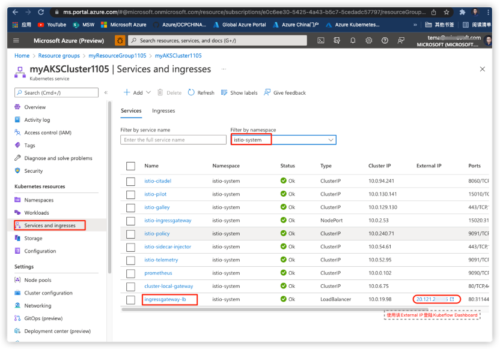

**云迁移-实施及切割上线环节经验分享**

之前我们的文章["传统IT
向云迁移的实践指南](https://mp.weixin.qq.com/s/D3feGkMLqXI52JckcypBAw)"介绍了云迁移是一个复杂的过程，迁移项目实施流程通常为：**1）需求调研
2）迁移方案详细设计 3）技术验证 4）实施及切割 5）迁移结果验证及验收**。

{width="5.651042213473316in"
height="2.9436297025371827in"}

根据云迁移项目的应用复杂程度，上线切割过程通常会有一个或多个短暂的窗口期，如果客户是拥有众多核心关键业务的中大型企业，通常应用切割上云（业务中断）窗口期会在非业务繁忙期的8-24小时（借助工具，线上迁移方式时间会短一些）。一个迁移项目前期的需求调研、迁移设计、迁移验证可能需要花费几个月的时间，而完成迁移成功的结果就在这样的几个切割窗口期里体现，如果经验不足的迁移团队在切割的环节出现问题，导致切割失败，参与人（客户、迁移服务商等）会有严重的挫败感。正好比家里包饺子花了半天时间准备，而煮饺子只需要几分钟时间，饺子下锅后发现饺子皮破口，馅露了出来，那种郁闷的失落感可想而知。

-   **切割上线前的准备**

针对切割上线的重要性，也许各方领导都会叮嘱："**认真、谨慎、仔细**"，具体在实施切割上线的时候如何执行这样主观空洞但**"正确**"的指示呢。

在迁移设计环节会设计一个迁移实施切割计划，这个计划的**严谨程度**也许很大程度上决定了迁移成功率。优秀的云迁移服务商会从之前的项目中不断地总结成功的经验和失败的教训，沉淀出自己的一套体系化的迁移方法。以下给出几个经验，

1.  切割前需要严格确认是否所有需要预先准备的工具、迁移环境（客户本地数据中心端、网络、云端）等已经就绪。

2.  检查和确认云环境着陆区（Landing
    Zone，云上使用的资源）已经就绪，并且确认云环境中的规模，安全，控制，网络以及身份验证与设计保持一致。

> {width="6.0in"
> height="4.479861111111111in"}

3.  切割上线时需多方人员参与，软硬件厂商、集成商、用户方、云厂商、网络运营商等,确认这些相关人员是否已经就绪。支持的方式是现场、远程还是电话。

4.  风险预案是否就绪。切割过程好像在打一场大的战役，很多的任务或子任务会分配半小时内计划执行结束，整个过程可能会紧张到心脏要跳出来了。为降低压力，退一步海阔天空，即使因为某个主客观原因导致迁移无法成功进行，如果有补救措施会让整个迁移团队降低很多压力。这个补救措施之一就是回退预案，也即是失败后回退到客户的原数据中心恢复业务应用，需要在切割时预留回退执行的时间。回退执行后，然后拥有充足的时间排查问题，以备下一个切割窗口期内再次切割。

5.  向Azure迁移的项目，可以参考一些工具来设计一个检查列表，比如:
    [迁移评估及准备工具(SMART),](https://docs.microsoft.com/zh-cn/assessments/?mode=pre-assessment&session=local)
    [Azure迁移向导,](https://ms.portal.azure.com/#blade/Microsoft_Azure_Resources/QuickstartPlaybookBlade/guideId/migration-setup)
    [Azure实施向导](https://ms.portal.azure.com/#blade/Microsoft_Azure_Resources/QuickstartPlaybookBlade/guideId/innovation-setup)。这个计划表里面包含了迁移切割过程的全部任务、时间段、各方执行人员、备岗支持人员等。"**认真、谨慎、仔细**"的按照这个切割计划表执行就好了。下图给出一个示例模板，在具体的项目中可以根据项目需求来设计定制的迁移切割计划

{width="6.0in" height="5.916666666666667in"}

**云迁移切割计划**

-   **切割上线**

如之前提到，迁移项目是复杂的，大部分迁移切割的时候都会或多或少的遇到一些无法预料的问题。如何保证切割成功率，降低失败的风险？从过去遇到的失败案例说起，有主观原因和客观因素。主观原因可能因为迁移调研问题、迁移方案设计缺陷、迁移验证过程不够全面等。客观因素通常是客户IDC、运营商网络、云数据中心故障等。无论那种问题导致，都可能会对迁移切割造成失败。以下分享一些切割经验，

1.  **数据验证，确认切割时与切割前数据保持一致**。通常客户的大部分服务器镜像及数据会在切割前预先在云端复制完成。在切割窗口期开启后需要确保云端复制的数据与客户数据中心下线前保持一致。

2.  **并非所有问题都会导致迁移失败**。遇到问题的时候，先不用荒，首先评估问题的严重程度，如果不是关键业务应用的重要的问题，可以将切割流程继续进行，同时该问题继续解决。与客户协商，该问题是否会会对业务有很大影响，如果客户可以接受的话，可以先上线，然后尽快解决该问题。

3.  **迁移时间拖延问题处理。**如果切割时不够顺利，因为种种主客观原因导致迁移切割时间长于计划时间，可以与客户协调，一起决定是否可以延迟一些时间上线。基于经验，通常设计切割计划时都会留出一些缓冲时间，如果需要延迟的时间过长是客户无法接受的，那就只能失望的迁移过程回退了。

4.  **网络切换问题处理**。比如IP,端口，网络配置,DNS等问题，在之前的调研和检查中出现遗漏（这个信息提供方可能由客户的IT部门，第三方IT运维公司，应用系统集成商以及自动工具提供）。这种问题在切割时经常会遇到，出现这种问题紧急联系相关负责方尽快解决，但并不一定会影响切割整体进行。

5.  **迁移的不仅是服务器或数据，而是整个企业的IT应用及环境**，客户应用需要的身份管理、安全配置、数据及系统备份、高可用性架构配置，容灾方案等都需要完成。

6.  **严格按照迁移设计方案中指定的云服务型号（SKU）匹配云上资源。**拿VM举例，通常云上会提供十几个系列，数百种VM型号，使用错误的VM即使能够将服务启动起来，但会带来性能、功能以及成本的问题。当使用了错误的VM型号后，可以通过云上提供的型号切换功能切换到正确的VM型号，无需删除VM。

7.  **迁移过程确保安全合规。**数据迁移严格使用加密数据传输，加密数据存储。证书、密码、权限按照合规的方式申请和使用，杜绝泄露隐患。避免因安全合规性问题带给客户严重损失。

-   **切割上线后验证和结果讨论**

切割后对迁移的结果进行验证，通常有先后两个部分，即迁移服务商验证和客户验证。分享以下一些经验

1.  **衡量迁移是否成功需要按照迁移之前定义的参考指标进行。**通常迁移服务商会在迁移切割时确定迁移的服务器、数据、网络等IT服务资源是否已经能够在新的云环境下运行起来。这种技术验证只是一个最初级的，在这基础之上还要验证数据一致性、性能指标、安全标准、成本状况等，这些验证信息的定义都会在迁移设计时定义清楚。当满足了整个应用的全面运维指标时才能算验证成功。

2.  **当迁移服务商验证迁移结果后，会由客户进行验证**，这时客户会对应用IT环境及业务功能进行验证，验证过程会更加权威，当遇到一些问题的时候需要运维服务商和客户一起讨论，此环节可能因为客户期望与迁移结果的差异对迁移后的环境做局部的调整，这时需要评估工作量和实现时间，尽量避免不明确的问题产生，导致验收结果拖延。

-   **总结**

云迁移需要一个体系化的流程来实施上线，它不仅需要依靠工具还需要正确的流程、完备的支持人员以及解决紧急问题经验来支撑，希望以上的经验分享能够对有云迁移诉求的技术人员有所帮助。
